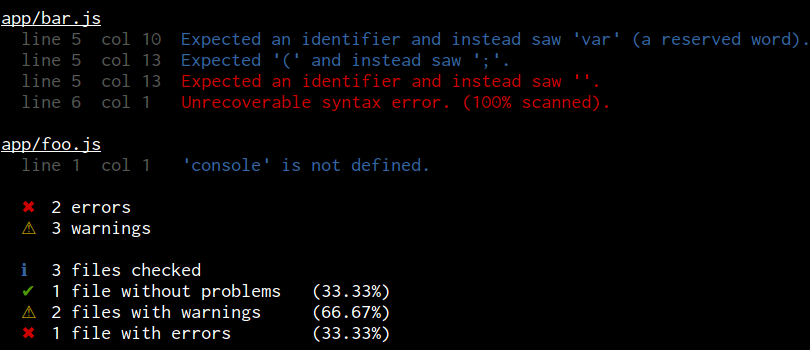
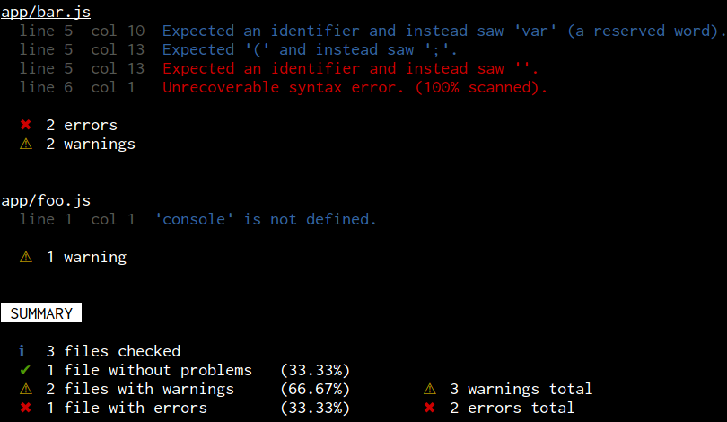

[](https://www.npmjs.com/package/jshint-stylish-summary)
[](https://travis-ci.org/svenschoenung/jshint-stylish-summary)
[](https://coveralls.io/github/svenschoenung/jshint-stylish-summary?branch=master)
[](https://david-dm.org/svenschoenung/jshint-stylish-summary)
[](https://david-dm.org/svenschoenung/jshint-stylish-summary#info=devDependencies)
[](https://codeclimate.com/github/svenschoenung/jshint-stylish-summary)


# jshint-stylish-summary

A stylish summary reporter for [jshint](https://github.com/jshint/jshint). Best used in combination with [jshint-stylish](https://github.com/sindresorhus/jshint-stylish).

Brought on by [this Stack Overflow question](http://stackoverflow.com/q/36010512/5892036).

## Screenshots

Default output with [jshint](https://github.com/jshint/jshint) (in combination with [jshint-stylish](https://github.com/sindresorhus/jshint-stylish)):



Default output with [gulp-jshint](https://github.com/spalger/gulp-jshint)  (in combination with [jshint-stylish](https://github.com/sindresorhus/jshint-stylish)):



## Installation

    npm install --save-dev jshint-stylish-summary

## Usage

### With [jshint](https://github.com/jshint/jshint)

    $ jshint --reporter=node_modules/jshint-stylish-summary src/js/*.js

Since jshint's CLI [doesn't currently support multiple reporters](https://github.com/jshint/jshint/issues/1702) it is necessary to create a wrapper reporter if jshint-stylish-summary should be used in combination with another reporter.

To use jshint-stylish-summary with, e.g., [jshint-stylish](https://github.com/sindresorhus/jshint-stylish), create a file `reporter.js`:

```js
module.exports = {
  reporter: function(result, config, options) {
    require('jshint-stylish').reporter(result, config, options);
    require('jshint-stylish-summary').reporter(result, config, options);
  }
};
```

Then pass this file to jshint:

    $ jshint --reporter=reporter.js src/js/*.js

### With [gulp-jshint](https://github.com/spalger/gulp-jshint)

Since jshint-stylish-summary needs to collect information about all files passing through the stream before it can log the results, it is not compatible with gulp-jshint's [`reporter()`](https://github.com/spalger/gulp-jshint#external) interface.

Instead use the [`collect()`](API.md#collectstat) and [`summarize()`](API.md#summarizestat-options-summarizeoptions) functions that jshint-stylish-summary provides:

```js
var jshintSummary = require('jshint-stylish-summary');

gulp.task('lint', function() {
  return gulp.src('src/**/*.js')
    .pipe(jshint('.jshintrc'))
    .pipe(jshint.reporter('jshint-stylish'))
    .pipe(jshintSummary.collect())
    .on('end', jshintSummary.summarize());
});
```

See the [API documentation](API.md) for a complete overview of all available functions and options.

## License

[MIT](LICENSE)
